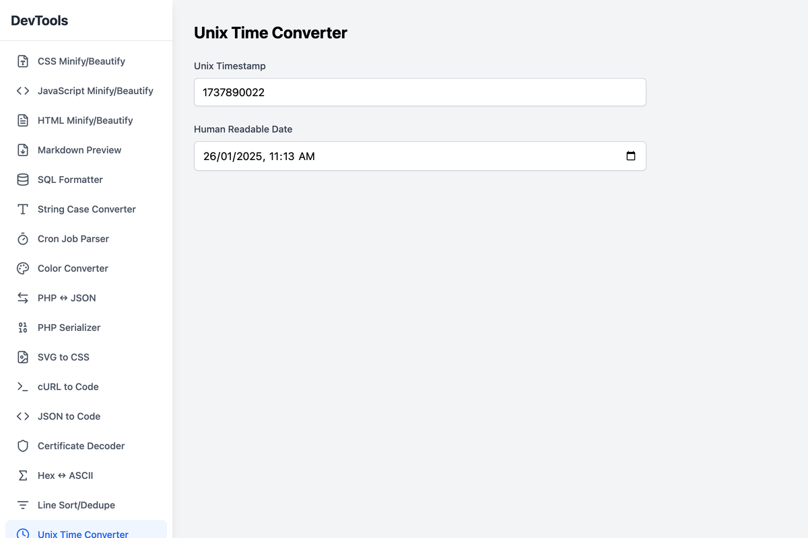

# DevUtils

> **Professional developer utilities that work entirely in your browser. Privacy-first, offline-capable tools for everyday development tasks.**

[](https://github.com/nadimtuhin/devutils/actions)
[](https://opensource.org/licenses/MIT)
[](https://www.typescriptlang.org/)
[](https://reactjs.org/)

## Overview

DevUtils is a comprehensive suite of developer utilities designed for maximum productivity and privacy. All processing happens locally in your browser—no data is ever transmitted to external servers.

## 🛠 Tool Categories

### **Code Formatting & Validation**
- **SQL Formatter** - Format and beautify SQL queries with syntax highlighting
- **JSON Validator & Beautifier** - Validate, format, and minify JSON data
- **YAML Formatter & Validator** - Format and validate YAML with syntax highlighting
- **Makefile Validator** - Validate Makefile syntax and detect common errors
- **HTML Minifier/Beautifier** - Optimize or format HTML markup
- **CSS Processor** - Minify, beautify, and optimize CSS stylesheets
- **JavaScript Formatter** - Format and minify JavaScript code

### **Data Conversion & Transformation**
- **Base64 Encoder/Decoder** - Encode and decode Base64 strings and images
- **PHP Array ↔ JSON Converter** - Convert between PHP arrays and JSON
- **PHP Serializer** - Serialize and unserialize PHP data structures
- **CSV ↔ JSON Converter** - Transform data between CSV and JSON formats
- **YAML ↔ JSON Converter** - Convert between YAML and JSON formats
- **String Case Converter** - Transform text between various naming conventions
- **SVG to CSS Converter** - Convert SVG graphics to CSS data URIs
- **Color Converter** - Convert between HEX, RGB, HSL, and other color formats
- **Hex ↔ ASCII Converter** - Convert between hexadecimal and ASCII text
- **cURL to Code Generator** - Convert cURL commands to various programming languages

### **Security & Cryptography**
- **Certificate Decoder** - Decode and analyze X.509 certificates
- **Certificate Generator** - Generate self-signed certificates for development
- **JWT Debugger** - Decode and verify JSON Web Tokens
- **Hash Generator** - Generate MD5, SHA1, SHA256, and other hashes
- **UUID Generator** - Generate various UUID formats (v1, v4, ULID)

### **Development Utilities**
- **RegExp Tester** - Test and debug regular expressions with live matching
- **Cron Job Parser** - Parse and explain cron expressions in human-readable format
- **Unix Timestamp Converter** - Convert between Unix timestamps and human dates
- **URL Parser & Encoder** - Parse URLs and encode/decode URL components
- **Number Base Converter** - Convert between binary, octal, decimal, and hexadecimal
- **Text Diff Viewer** - Compare text files with syntax highlighting
- **Line Sorter** - Sort text lines with various sorting options
- **Lorem Ipsum Generator** - Generate placeholder text for design and development
- **HTML Entity Converter** - Encode and decode HTML entities
- **HTML to JSX Converter** - Convert HTML markup to React JSX
- **Backslash Encoder** - Escape and unescape backslashes in strings
- **Markdown Preview** - Live preview of Markdown documents
- **HTML Preview** - Render and preview HTML code

## 🚀 Quick Start

### Prerequisites
- Node.js 18+ and npm/pnpm
- Modern web browser

### Installation & Development

```bash
# Clone the repository
git clone https://github.com/nadimtuhin/devutils.git
cd devutils

# Install dependencies
npm install
# or
pnpm install

# Start development server
npm run dev

# Build for production
npm run build

# Run tests
npm test

# Lint code
npm run lint
```

The application will be available at `http://localhost:5173`

## 🏗 Architecture

### **Technology Stack**
- **Frontend Framework**: React 18 with TypeScript
- **Build Tool**: Vite 6 for fast development and optimized builds
- **Styling**: TailwindCSS for utility-first styling
- **Routing**: React Router for client-side navigation
- **Testing**: Jest with React Testing Library
- **Code Quality**: ESLint, Prettier, and TypeScript for code consistency
- **Security**: Trivy for vulnerability scanning

### **Project Structure**
```
src/
├── components/          # Individual tool components
├── utils/              # Shared utility functions
├── types/              # TypeScript type definitions
└── main.tsx           # Application entry point
```

### **Key Features**
- **Privacy-First**: All processing happens locally in your browser
- **Offline Capable**: Works without internet connection
- **Responsive Design**: Optimized for desktop and mobile devices
- **Drag & Drop**: Intuitive file handling for supported tools
- **Keyboard Shortcuts**: Power-user shortcuts for common actions
- **Search Functionality**: Quickly find tools with spotlight search

## 🔒 Security & Privacy

### **Privacy Commitment**
- **Zero Data Collection**: No analytics, tracking, or data collection
- **Local Processing**: All operations performed client-side
- **No Network Requests**: Tools work completely offline
- **Open Source**: Full transparency with source code available

### **Security Scanning**
This project implements comprehensive security scanning using [Trivy](https://trivy.dev/):

#### **Automated Security Checks**
- Vulnerability scanning for dependencies
- Secret detection in codebase
- Configuration security analysis
- Container image scanning (if applicable)

#### **Available Security Commands**
```bash
# Full security scan
npm run security:scan

# Dependencies only
npm run security:scan-deps

# Generate reports
npm run security:scan-json    # JSON format
npm run security:scan-html    # HTML format
```

#### **CI/CD Integration**
- Automated scans on every pull request
- Security reports uploaded to GitHub Security tab
- Weekly scheduled vulnerability assessments
- Dependency update notifications

## 🤝 Contributing

We welcome contributions from the community! Whether you're fixing bugs, adding new tools, or improving documentation, your help is appreciated.

### **Development Workflow**
1. **Fork** the repository
2. **Clone** your fork locally
3. **Create** a feature branch: `git checkout -b feature/new-tool`
4. **Develop** your changes with tests
5. **Test** your changes: `npm test && npm run lint`
6. **Commit** with descriptive messages
7. **Push** to your fork: `git push origin feature/new-tool`
8. **Open** a Pull Request

### **Adding New Tools**
1. Create component in `src/components/YourTool.tsx`
2. Add route in `src/App.tsx`
3. Include icon and metadata
4. Write tests for core functionality
5. Add documentation and examples

### **Code Standards**
- Follow existing TypeScript patterns
- Use TailwindCSS for styling
- Include comprehensive error handling
- Add unit tests for utility functions
- Maintain responsive design principles

### **Pull Request Guidelines**
- Provide clear description of changes
- Include screenshots for UI changes
- Ensure all tests pass
- Keep commits atomic and well-documented

## 📄 License

This project is licensed under the **MIT License**. See the [LICENSE](LICENSE) file for details.

## 🌟 Support the Project

If you find DevUtils helpful, please consider:
- ⭐ **Starring** the repository
- 🐛 **Reporting** bugs and issues
- 💡 **Suggesting** new features
- 🤝 **Contributing** code or documentation
- 📢 **Sharing** with other developers

## 📊 Project Stats

[](https://github.com/nadimtuhin/devutils/stargazers)
[](https://github.com/nadimtuhin/devutils/network/members)
[](https://github.com/nadimtuhin/devutils/issues)
[](https://github.com/nadimtuhin/devutils/pulls)

## 📸 Screenshots

### Featured Tools

<table>
  <tr>
    <td align="center">
      
      <br/><strong>JSON Formatter</strong>
    </td>
    <td align="center">
      
      <br/><strong>SQL Formatter</strong>
    </td>
  </tr>
  <tr>
    <td align="center">
      
      <br/><strong>Color Converter</strong>
    </td>
    <td align="center">
      
      <br/><strong>Certificate Decoder</strong>
    </td>
  </tr>
</table>

## 🙏 Acknowledgments

DevUtils is built with amazing open-source technologies:

- **React** - UI framework
- **TypeScript** - Type safety and developer experience
- **Vite** - Lightning-fast build tool
- **TailwindCSS** - Utility-first CSS framework
- **Trivy** - Security vulnerability scanner
- All the specialized libraries that power individual tools

Special thanks to all contributors and the open-source community for making this project possible.

---

<div align="center">
  <strong>Built with ❤️ for developers, by developers</strong>
  <br/>
  <sub>Privacy-first • Open Source • Community Driven</sub>
</div>
