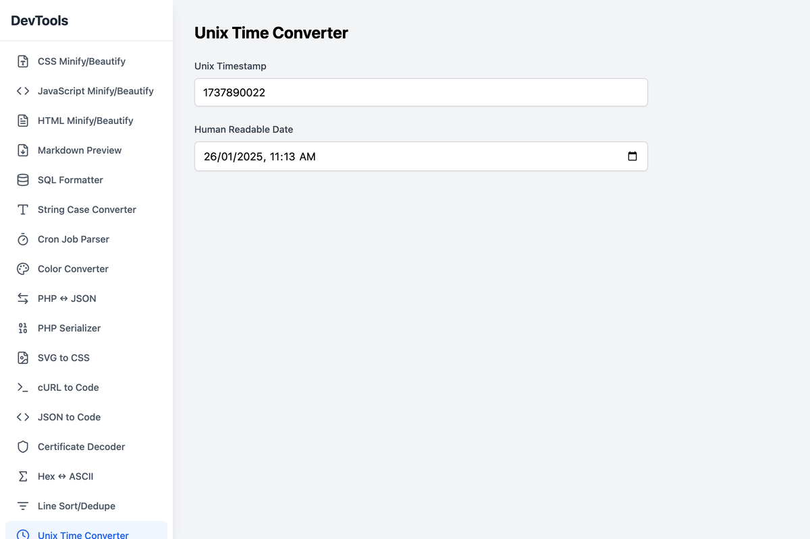

<div align="center">

# DevUtils

**35+ privacy-first developer tools. All processing happens in your browser — zero data sent to any server.**

[](https://github.com/nadimtuhin/devutils/actions/workflows/ci.yml)
[](./LICENSE)
[](https://www.typescriptlang.org/)
[](https://react.dev/)
[](https://devutils-one.vercel.app)

</div>

---

## Why DevUtils?

- **Privacy-first** — No data ever leaves your browser. Every operation runs locally.
- **Offline-capable** — Works without an internet connection once loaded.
- **35+ tools** — Formatters, converters, encoders, decoders, and more in one place.
- **Free & open source** — MIT licensed, community-driven, no paywalls.

---

## Tools

| Category | Tools |
|---|---|
| **Code Formatting** | SQL Formatter, JSON Validator & Beautifier, YAML Formatter, HTML Min/Beautify, CSS Processor, JavaScript Formatter, Makefile Validator |
| **Data Conversion** | Base64 Encoder/Decoder, Base64 Image, CSV↔JSON, YAML↔JSON, PHP Array↔JSON, PHP Serializer, SVG→CSS, Hex↔ASCII, cURL→Code, JSON→Code, HTML→JSX |
| **Security & Crypto** | JWT Debugger, Certificate Decoder, Certificate Generator, Hash Generator (MD5/SHA), UUID/ULID Generator, K8s Secret Decoder |
| **Text & Utilities** | RegExp Tester, Cron Parser, Unix Timestamp, URL Parser/Encoder, Color Converter, Text Diff, Line Sorter, String Case Converter, Number Base Converter, Lorem Ipsum, HTML Entity Converter, Backslash Encoder, Markdown Preview, HTML Preview |

---

## Quick Start

```bash
git clone https://github.com/nadimtuhin/devutils.git
cd devutils
pnpm install
pnpm dev
```

App is available at http://localhost:5173

---

## Stack

| | |
|---|---|
| **Framework** | React 18 |
| **Language** | TypeScript |
| **Bundler** | Vite 6 |
| **Styling** | TailwindCSS |
| **Routing** | React Router |
| **Testing** | Jest + React Testing Library |

---

## Contributing

Contributions are welcome. See [CONTRIBUTING.md](./CONTRIBUTING.md) for guidelines.

Adding a new tool takes ~30 minutes — the codebase is structured to make it straightforward.

---

## Screenshots

| | |
|:---:|:---:|
|  |  |
|  |  |
|  |  |

---

## License

MIT — see [LICENSE](./LICENSE) for details.

---

<div align="center">

Built with ❤️ for developers, by developers | Privacy-first • Open Source • Offline-capable

</div>
